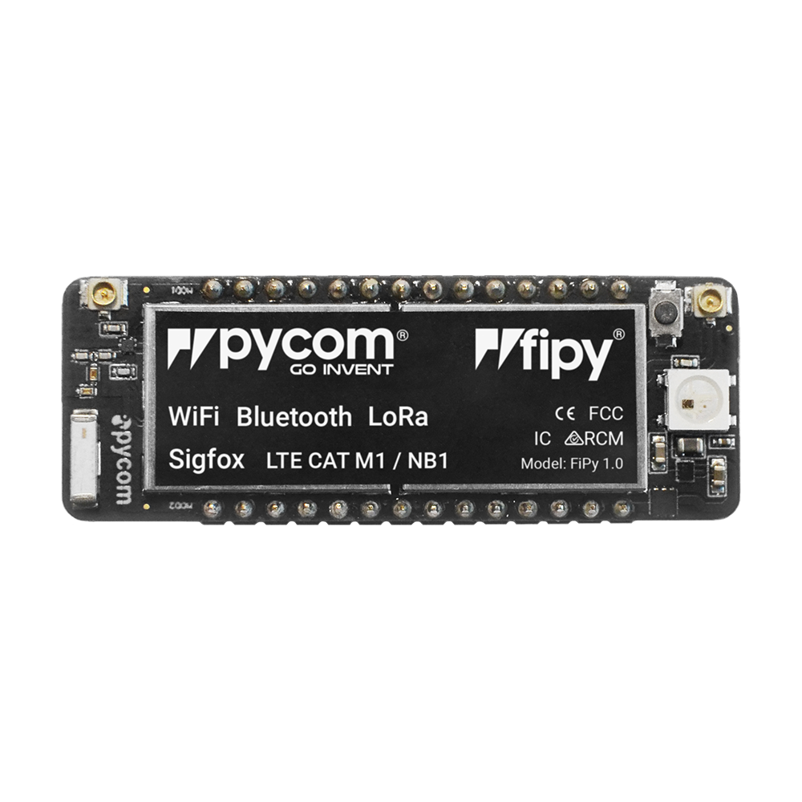
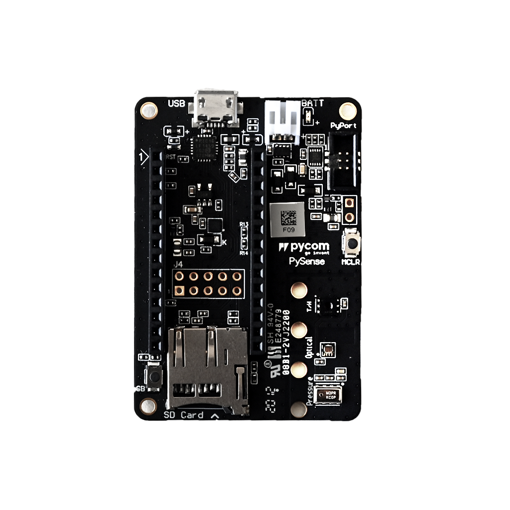
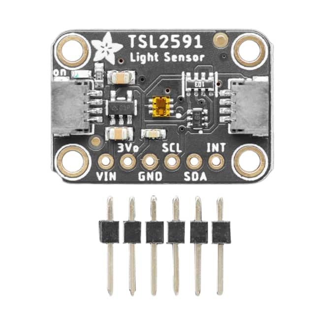
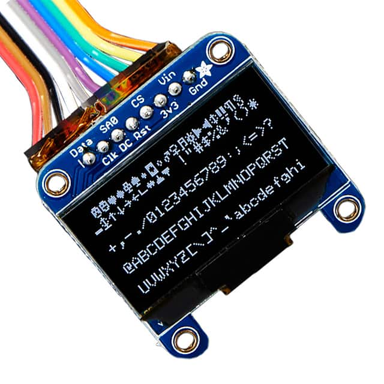
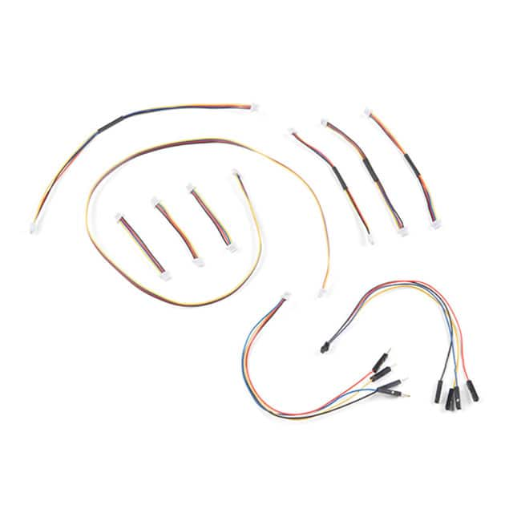
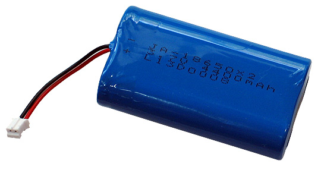
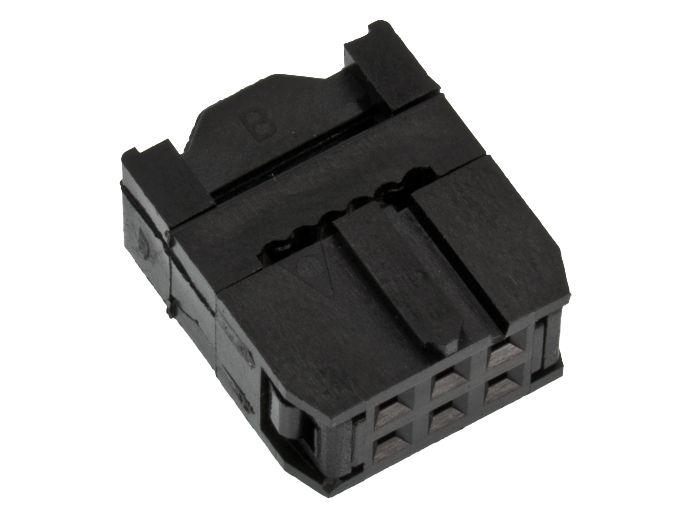
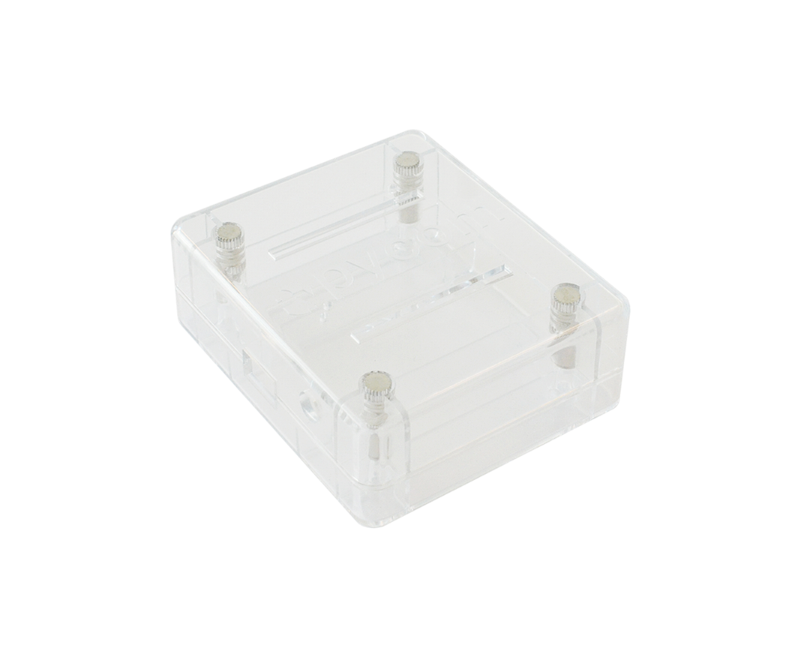

# Bill of Material for course 2022

Bill of materials for the course in Applied IoT ([Tillämpad IoT Introduktion, 1DT305](https://lnu.se/kurs/tillampad-internet-of-things-introduktion/distans-sommar/)) @ Linnaeus University 2022.

## Hardware
| Thing |  | Manufacturer | Supplier info | estimated price |
| --- | --- | --- | --- | --- |
|  | FiPy IoT Dev Board | Pycom Ltd. | [Mouser #365-FIPY](https://www.mouser.se/ProductDetail/Pycom/FiPy?qs=EU6FO9ffTwdV%252B6dSsRNFvw%3D%3D) | 751,50 SEK |
|   | Pysense 2.0 Epansion Shield | Pycom Ltd. | [Mouser #365-PYSENSE](https://www.mouser.se/ProductDetail/Pycom/Pysense?qs=EU6FO9ffTweZdgO1RoTWIg%3D%3D) | 304.50 SEK |
|   | TSL2591 Light Sensor | Adafruit Industries LLC #1980 | [Digi-Key #1528-1037-ND](https://www.digikey.se/sv/products/detail/adafruit-industries-llc/1980/4990786?s=N4IgTCBcDaIIwFYwA4C0cAMBmA7KgcgCIgC6AvkA) | 87.83 SEK |
|  | Monochrome 1.3" 128x64 OLED graphic display - STEMMA QT/Qwiic | Adafruit Industries LLC #938 | [Digi-Key #1528-1512-ND](https://www.digikey.se/sv/products/detail/adafruit-industries-llc/938/5774238?s=N4IgTCBcDaIIwFYwA4C0i5lQOQCIgF0BfIA) | 252.11 SEK |
|  | SparkFun Qwiic Cable Kit | SparkFun Electronics KIT-15081 | [Digi-Key #1568-1961-ND](https://www.digikey.se/sv/products/detail/sparkfun-electronics/KIT-15081/9770723?s=N4IgTCBcDaIIwFYBsAOAtHAnEuaByAIiALoC%2BQA)| 113.10 SEK |
|  | Batteri LiPo 3.7V 4400mAh, with JST-connection |  | [Electro:kit](https://www.electrokit.com/produkt/batteri-lipo-3-7v-4400mah/)| 249.00 SEK |
|  | IDC female, 6-pol |  | [Electro:kit](https://www.electrokit.com/produkt/idc-hona-kabel-6-pol-2-54mm/)| 7.90 SEK |
|  | Pycase Clear (To small to fit FiPy + Pysense 2.0! ...buy something else!) |  | [M.nu](https://www.m.nu/pycom/pycase-clear)| 89.00 SEK |

## Suppliers
* [Electro:kit](https://www.electrokit.com/)
* [PyCom](https://pycom.io)
* [Digi-Key](https://www.digikey.se)
* [Mouser](https://www.mouser.se)
* [M.nu](https://www.m.nu)
